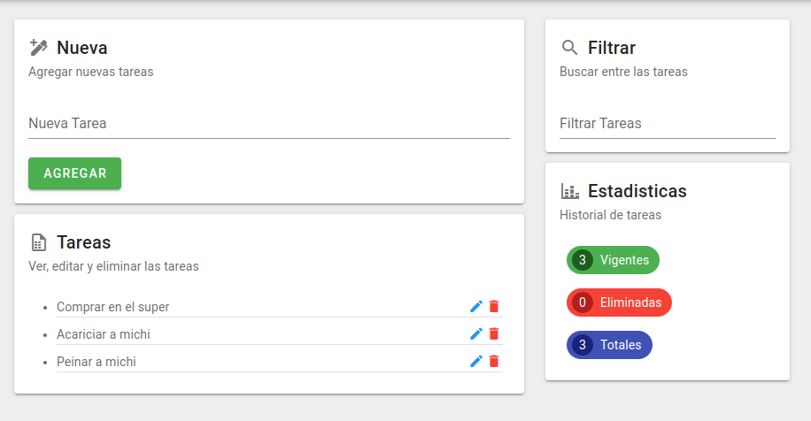

# Gestor de Tareas 

_Gestor de tareas desarrollado en VueJS._


### ¿Qué puedo hacer? 📋

_Contiene una sección para agregar, ver, editar y eliminar tareas._

_Además tiene la posibilidad de filtrar e incluye métricas de las tareas para que puedas visualizar todo el historial._




### Desarrollo de la App 🔧

_Esta aplicación está desarrollada con:_

* VueJS
* Vuex
* Vuetify

## Setup 📦

_Instalar dependencias:_

```
npm install
```

_Correr el proyecto:_

```
npm run serve
```

---
Hecho con amor ❤️ por [Lushan](https://github.com/dracaster) 😊
